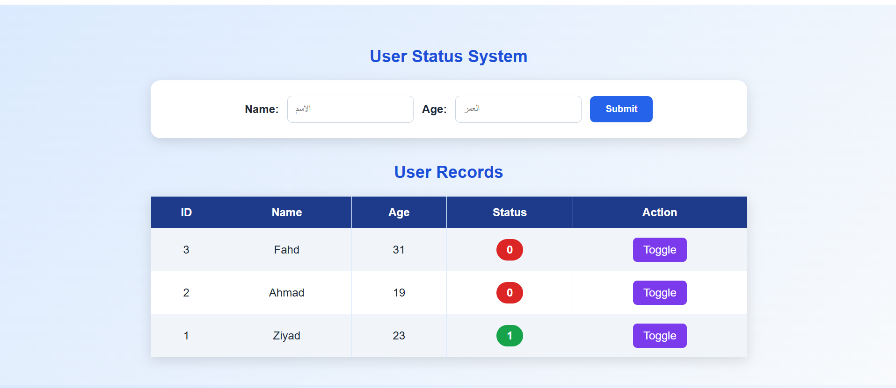
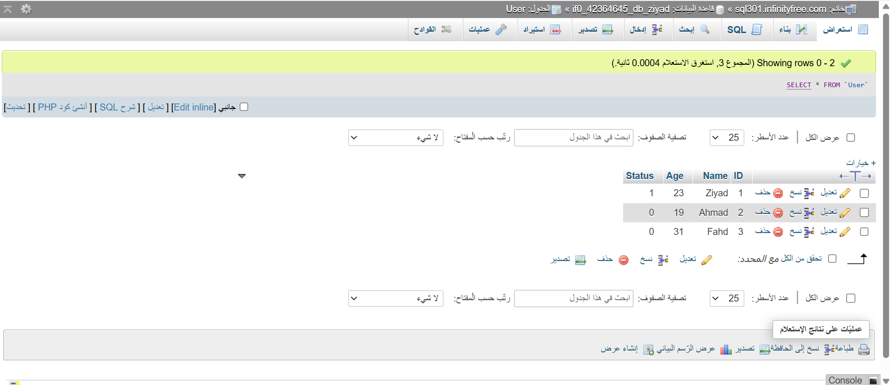

# php-mysql-user-status
A simple PHP and MySQL webpage that stores user information and toggles the status between 0 and 1.

## Live Website

[Open the User Status System](https://ziyad-alzahrani.fwh.is/Z.php)

## Project Overview

This project is a simple user status management webpage developed using HTML, CSS, PHP, and MySQL.

The system allows the user to enter a name and age through a form. The submitted information is stored in a MySQL database and displayed in a table below the form.

Each record includes a status value that can be switched between `0` and `1` using the **Toggle** button.

## Features

- Add a user's name and age
- Store submitted data in a MySQL database
- Display all database records in a table
- Show the ID, name, age, and status of each user
- Toggle the status between `0` and `1`
- Display status `0` in red
- Display status `1` in green
- Responsive and organized webpage design

## Project Preview

### User Status Webpage



### MySQL Database Records



## Technologies Used

- HTML
- CSS
- PHP
- MySQL
- phpMyAdmin
- InfinityFree Hosting
- GitHub

## Database Structure

The project uses a MySQL table named `User`.

| Column | Type | Description |
|---|---|---|
| ID | INT | Primary key with Auto Increment |
| Name | VARCHAR | Stores the user's name |
| Age | INT | Stores the user's age |
| Status | TINYINT | Stores either 0 or 1 |

The default value of `Status` is `0`.

## Project Files

- `Z.php` - Contains the main webpage, form, and database records section
- `n.php` - Receives the form data and inserts it into the database
- `display.php` - Retrieves database records and handles the Toggle button
- `status-style.css` - Contains the webpage design and styling
- `config.example.php` - Example database connection configuration
- `user-status-system.png` - Screenshot of the final webpage
- `database-records.png` - Screenshot of the MySQL database records
- `README.md` - Project documentation

## How the System Works

1. The user enters a name and age.
2. The user clicks the **Submit** button.
3. The data is sent to `n.php`.
4. PHP inserts the information into the MySQL database.
5. The new record appears in the table.
6. Every new record receives a default status value of `0`.
7. Clicking the **Toggle** button changes:
   - `0` to `1`
   - `1` to `0`
8. The updated value is stored in the database and displayed on the webpage.

## Database Configuration

Create a file named `config.php` on the server and enter the database information:

```php
<?php

$servername = "YOUR_DATABASE_HOST";
$username = "YOUR_DATABASE_USERNAME";
$password = "YOUR_DATABASE_PASSWORD";
$dbname = "YOUR_DATABASE_NAME";

?>
